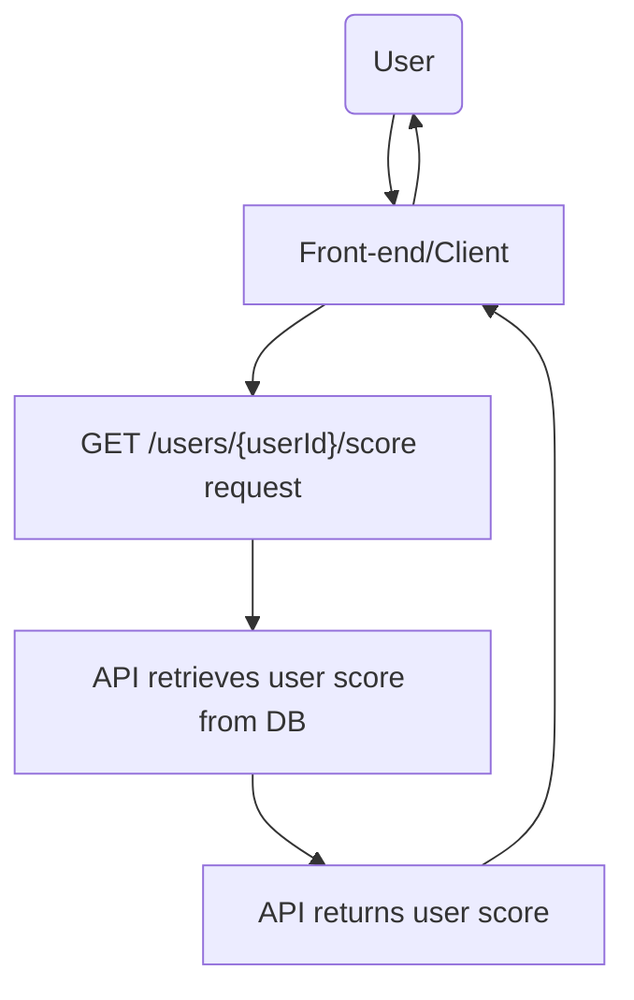
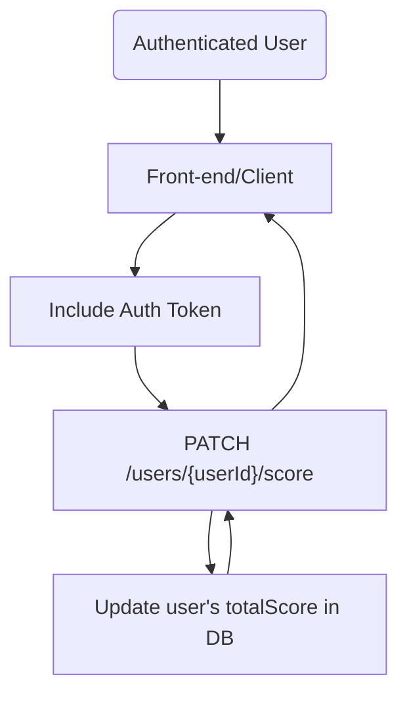
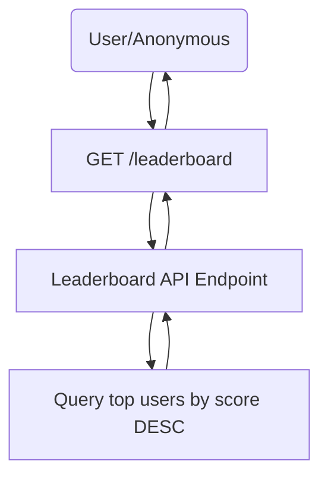

# Score API Specification

This **Score API** manages user scores for an online testing platform where each completed test contributes to a user’s overall score. This README documents the main requirements, endpoints, data models, and usage examples.

## Table of Contents

1. [Overview](#overview)
2. [Functional Requirements](#functional-requirements)
3. [Non-Functional Requirements](#non-functional-requirements)
4. [Data Model](#data-model)
5. [API Endpoints](#api-endpoints)
   - [Retrieve User Score](#51-retrieve-user-score)
   - [Update User Score](#52-update-user-score)
   - [Retrieve Leaderboard](#53-retrieve-leaderboard)
6. [Use Case Diagrams](#use-case-diagrams)
   - [Retrieve User Score](#61-use-case-diagram--retrieve-user-score)
   - [Update User Score](#62-use-case-diagram--update-user-score)
   - [Retrieve Leaderboard](#63-use-case-diagram--retrieve-leaderboard)
7. [Error Handling & Validation](#8-error-handling--validation)
8. [Security Considerations](#9-security-considerations)
9. [Conclusion](#10-conclusion)


---

## 1. Overview

The **Score API** will:
1. Allow the **front end** (or other services) to retrieve a user’s current score.
2. Provide a way to **update** a user’s score after completing an online test.
3. Return a **leaderboard** of top users, sorted by highest scores.

### Key Points

- **Scoring Logic**: A user’s score increases based on correct answers and the speed of completion. For this specification, assume the final score increment (`scoreDelta`) is calculated elsewhere or passed in.
- **Security**: The **update** endpoint must be protected by authentication. Other endpoints may be open or partially restricted based on your needs.

---

## 2. Functional Requirements

1. **Retrieve User Score**  
   - **Description**: Fetch the total score of a specified user.  
   - **Actors**: Front-end client, user.

2. **Update User Score**  
   - **Description**: Update a user’s score after they successfully complete a test.  
   - **Actors**: Front-end client (authorized), user.  
   - **Authentication**: Required. Only authenticated requests can update scores.

3. **Retrieve Leaderboard**  
   - **Description**: Return a list of the top users (highest to lowest scores).  
   - **Actors**: Front-end client, user (or public, depending on access control).

4. **Store and Manage Scores**  
   - **Description**: Maintain a database or persistent store with user scores.  
   - **Actor**: API / Database.

---

## 3. Non-Functional Requirements

1. **Performance**  
   - Leaderboard retrieval should be optimized to handle large numbers of users.  
   - Caching may be used to improve response times.

2. **Security**  
   - The score update endpoint requires authentication (JWT, OAuth2, etc.).  
   - All traffic should use HTTPS/TLS for encryption.

3. **Scalability**  
   - Support horizontal scaling for high read/write requests.

4. **Maintainability**  
   - Follow RESTful standards and ensure code is well-documented.

---

## 4. Data Model

### 4.1 User

```json
{
  "id": "string (UUID)",
  "username": "string",
  "email": "string"
}
```

### 4.2 Score

```json
{
  "userId": "string (UUID)",
  "totalScore": "number"
}

```

- Score can be a separate entity or embedded within the User model.
- totalScore represents the user’s total accumulated points.

## 5. API Endpoints

### 5.1 Retrieve User Score

```bash
GET /users/{userId}/score
```

**Description:** Returns the specified user’s current score.

- **Request Headers**
    - `Authorization: Bearer <token>` (optional if public access is allowed)
- **Response (200)**

```json
{
  "userId": "<UUID>",
  "username": "string",
  "totalScore": "number"
}
```
- **Response (404)**

```json
{
  "error": "User not found"
}
```

### 5.2 Update User Score

```bash
PATCH /users/{userId}/score
```

**Description:** Updates a user’s score after a test. **Requires authentication.**

- **Request Headers**
    - `Authorization: Bearer <token>`  (required)

- **Request body**

```json
{
  "scoreDelta": "number"  // Points to add; can be positive or negative
}
```

- **Response (200)**

```json
{
  "userId": "<UUID>",
  "totalScore": "<updatedTotalScore>"
}
```

- **Response (400)**

```json
{
  "error": "Invalid scoreDelta"
}
```

- **Response (401)**
```json
{
  "error": "Unauthorized or invalid token"
}
```

### 5.3 Retrieve Leaderboard

```bash
GET /leaderboard?limit={limit}
```

**Description:** Returns the top users sorted by score. The limit query parameter defines how many to return (default 10 if not provided).

- **Request Headers**
    - (Optional) `Authorization: Bearer <token>` (if restricted)

- **Response (200)**

```json
[
  {
    "userId": "<UUID>",
    "username": "string",
    "totalScore": "number"
  },
  {
    "userId": "<UUID>",
    "username": "string",
    "totalScore": "number"
  }
  // ...
]
```

## 6. Use Case Diagrams
The following simplified diagrams describe how different actors (users, clients, etc.) interact with the system.

### 6.1 Use Case Diagram – Retrieve User Score



### 6.2 Use Case Diagram – Update User Score



### 6.3 Use Case Diagram – Retrieve Leaderboard



## 7. Error Handling & Validation
- User Not Found (404)
    - Returned if the user ID does not exist.
- Bad Request (400)
    - Returned for invalid input (e.g., missing or non-numeric scoreDelta).
- Unauthorized (401)
    - Returned when an invalid or missing token is provided to a protected endpoint.
- Internal Server Error (500)
    - Covers unexpected errors (database outages, unknown exceptions, etc.).

## 8. Security Considerations
1. Authentication & Authorization
    - Use OAuth2, JWT, or similar.
    - Ensure only authorized clients can update scores.
2. Transport Security
    - All endpoints must be over HTTPS/TLS for data protection in transit.
3. Rate Limiting
- Implement rate limiting on the update endpoint to prevent abuse.

## 9. Conclusion
This document outlines the core design of the Score API:
- Endpoints for retrieving/updating scores and accessing a leaderboard.
- Authentication is mandatory for score updates.
- Leaderboards can be cached or retrieved dynamically from the database.